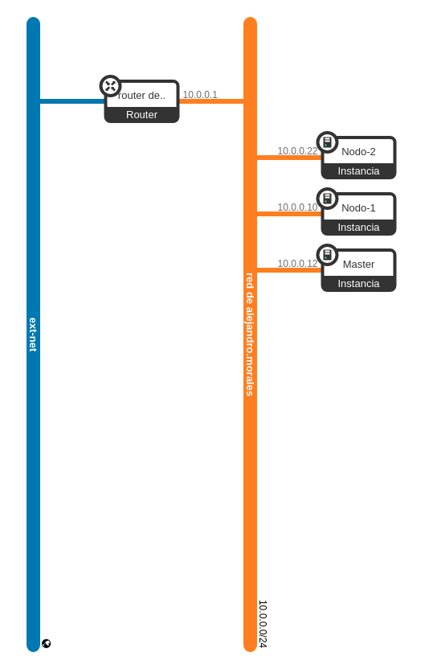
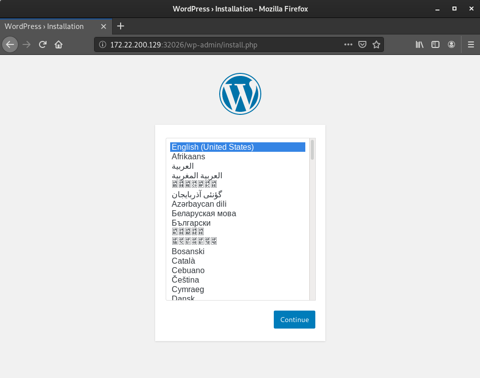
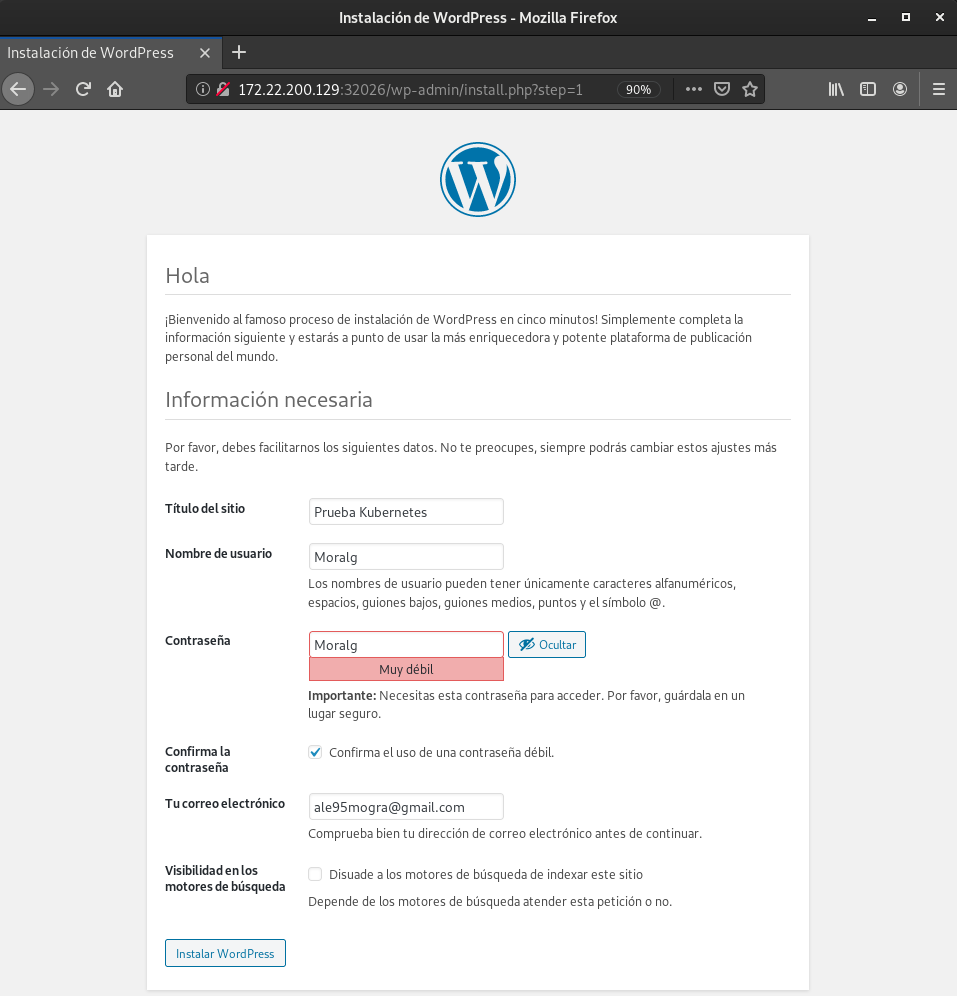
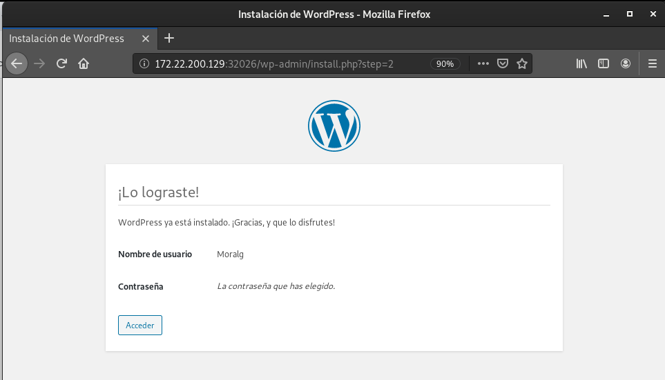
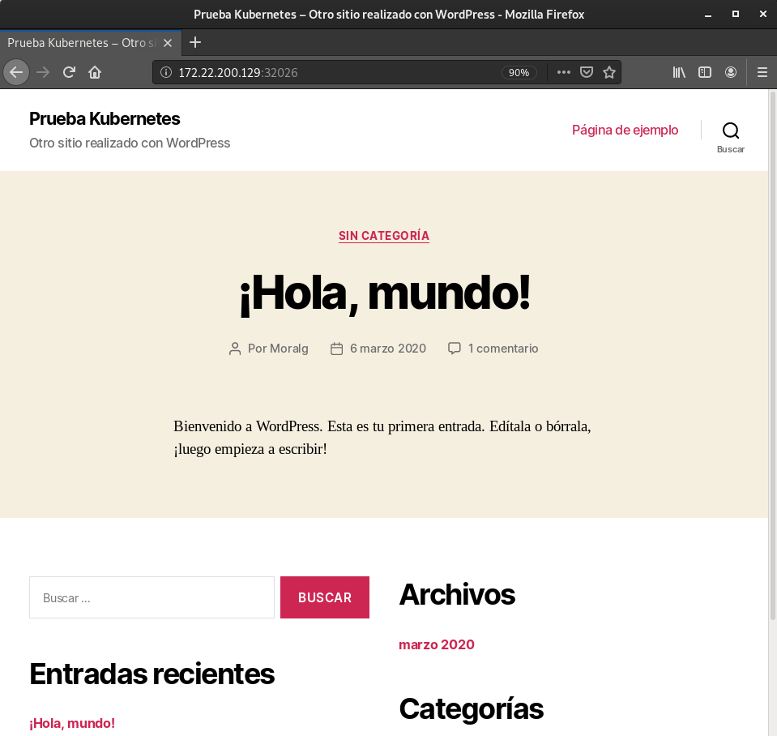

# Trabajando con Kubernetes con la herramienta Kubeadm

**Kubernetes** es un orquestador de contenedores. Un orquestador es el encargado de gestionar el ciclo de vida de los contenedores de una aplicación.

Kubernetes se ha convertido en el estandar y sus principales servicios que ofrece son:

* Manejo del clúster (permitir añadir o quitar nodos al clúster)
* Gestión del ciclo de vida de los contenedores (p. ej. reiniciar contenedores que fallen)
* Service Discovery (que un contenedor pueda encontrar las rutas IP/DNS de otro contenedor)
* Servicios de red y load-balancing (repartir la carga entre las distintas máquinas del clúster)
* Servicios de monitorización
* Servicios de chequeo de estado de salud (del clúster y de cada uno de los contenedores)

Tenemos que comprender antes de empezar a realizar la tarea, los nodos que necesitamos:

* **Nodo Master**: Los nodos master son los encargados de coordinar el clúster. Por lo general los nodos master no ejecutan contenedores. Aunque está permitido que lo hagan, no es un escenario recomendado en producción. Todo clúster de Kubernetes debe tener al menos un nodo master.

* **Nodos Minion**: Un nodo minion es aquel que ejecuta los contenedores desplegados en el clúster.

# Escenario



### Puertos necesarios para acceder al cluster de Kubernetes

Tenemos que abrir los puertos necesarios para la configuración de Kubernetes. En nuestro caso, al trabajar en el cloud de OpenStack tenemos que abrir los siguientes puertos:

* **80**: Para acceder a los servicios con el controlador Ingress.
* **443**: Para acceder a los servicios con el controlador Ingress y HTTPS.
* **6443**: Para acceder a la API de Kubernetes.
* **30000-40000**: Para acceder a las aplicaciones con el servicio NodePort.
  
-----------------------------------------------------------------------------------
> **NOTA**: Ya tenemos el escenario listo para realizar la tarea, mostraremos donde hay que realizar los puntos siguiente indicandolo entre paréntesis a las máquinas que se le aplican.

------------------------------------------------------------------------------------

# Instalación

### Instalación de Docker (Master, Nodo1, Nodo2)

Kubernetes trabaja por encima de docker, por lo que tenemos que instalar docker en la máquina **master** y en los **nodos**.

Instalamos los paquetes que nos permiten usar repositorios apt con https:

~~~
sudo apt update
sudo apt upgrade -y
~~~

~~~
sudo apt install \
apt-transport-https \
ca-certificates \
curl \
gnupg2 \
software-properties-common
~~~

-------------------------------------------------------------------

> **NOTA**: Tenemos que tener en cuenta que Kubernetes utilizar iptable-legacy, esto deberemos de actualizarlo en máquinas Debian ya que se utiliza nftables.

Cambiamos la versión del gestor del cortafuegos a legacy.

~~~
sudo apt install -y iptables arptables ebtables
sudo update-alternatives --set iptables /usr/sbin/iptables-legacy
sudo update-alternatives --set ip6tables /usr/sbin/ip6tables-legacy
sudo update-alternatives --set arptables /usr/sbin/arptables-legacy
sudo update-alternatives --set ebtables /usr/sbin/ebtables-legacy
~~~

----------------------------------------------------------------

Añadimos las claves GPG oficiales de Docker:

~~~
curl -fsSL https://download.docker.com/linux/debian/gpg | sudo apt-key add -
~~~

Añadimos el repositorio para nuestra versión de Debian:

~~~
sudo add-apt-repository \
   "deb [arch=amd64] https://download.docker.com/linux/debian \
   $(lsb_release -cs) \
   stable"
~~~

Y ahora ya podemos instalar docker:

~~~
sudo apt update
sudo apt install docker-ce -y 
~~~

Comprobamos la versión de docker instalada:

~~~
docker --version
    Docker version 19.03.7, build 7141c199a2
~~~

### Instalación de kubeadm, kubelet and kubectl (Master, Nodo1, Nodo2)

Vamos a instalar los paquetes necesarios para una instalación y configuración funcional de Kubernetes:

* **kubeadm**: Herramienta que nos permite crear el cluster.
* **kubelet**: Es el componente que se ejecuta en el master y en todos los nodos, el cual se encarga de ejecutar los pods y los contenedores.
* **kubectl**: Herramienta que nos permite controlar el cluster desde la linea de comandos.

La instalación de estos paquetes se realiza de la siguiente manera:

~~~
sudo su
apt update && apt install -y apt-transport-https curl
~~~

~~~
curl -s https://packages.cloud.google.com/apt/doc/apt-key.gpg | apt-key add -
~~~

~~~
cat <<EOF >/etc/apt/sources.list.d/kubernetes.list
deb http://apt.kubernetes.io/ kubernetes-xenial main
EOF
~~~
~~~
apt update
apt install -y kubelet kubeadm kubectl
~~~

### Configuración de Kubeadm (Master)

Para inicializar el cluster vamos a ejecutar el siguiente comando:

> **NOTA**: Es posible que tengamos que desastivar el swap `swapoff -a`, esto nos lo indica en la documentación.

~~~
kubeadm init --pod-network-cidr=192.168.0.0/16 --apiserver-cert-extra-sans=172.22.200.129
~~~

>`--pod-network-cidr`: La red por donde se comunican los nodos del cluster.
>
>`--apiserver-cert-extra-sans`: La IP flotante del master para que el certificado que se genera sea válido para esta ip, y se pueda controlar el cluster desde el exterior.

Al terminar nos muestra lo siguiente:

~~~
.
.
.
[kubelet-finalize] Updating "/etc/kubernetes/kubelet.conf" to point to a rotatable kubelet client certificate and key
[addons] Applied essential addon: CoreDNS
[addons] Applied essential addon: kube-proxy

Your Kubernetes control-plane has initialized successfully!

To start using your cluster, you need to run the following as a regular user:

  mkdir -p $HOME/.kube
  sudo cp -i /etc/kubernetes/admin.conf $HOME/.kube/config
  sudo chown $(id -u):$(id -g) $HOME/.kube/config

You should now deploy a pod network to the cluster.
Run "kubectl apply -f [podnetwork].yaml" with one of the options listed at:
  https://kubernetes.io/docs/concepts/cluster-administration/addons/

Then you can join any number of worker nodes by running the following on each as root:

kubeadm join 10.0.0.13:6443 --token fs76mb.qkazjoflk94irg6k \
    --discovery-token-ca-cert-hash sha256:360aac33035a9005fc8fd8c2cdf887a46175f21a86aa5e21de269a6eb670c059 

~~~

Lo que nos devuelve nos indica 3 pasos a realizar:

1. Las instrucciones que tenemos que ejecutar en la máquina **master** para usar el cliente kubectl y manejar el cluster. Este paso lo realizaremos a continuación:

~~~
mkdir -p $HOME/.kube
sudo cp -i /etc/kubernetes/admin.conf $HOME/.kube/config
sudo chown $(id -u):$(id -g) $HOME/.kube/config
~~~

2. La instalación de un pod para la gestión de la red, que se explicará en el siguiente [punto](https://github.com/MoralG/Trabajando_con_Kubernetes/blob/master/Trabajando_con_Kubernetes.md#configuraci%C3%B3n-del-pod-para-gestionar-la-red-master).

3. Y la instrucción que tenemos que ejecutar en los nodos para añadirlos al cluster. Utilizaremos un token para ello, que se explicará también en los siguientes [puntos](https://github.com/MoralG/Trabajando_con_Kubernetes/blob/master/Trabajando_con_Kubernetes.md#uniendo-los-nodos-al-cluster-nodo1-nodo2).

# Configuración

### Configuración del pod para gestionar la red (Master)

Tenemos que instalar un pod para permitir la comunicación de los distintos pods que vamos a iniciar en el cluster, esto lo realizaremos con el comando que nos proporciono la ejecución del cluster en la anterior tarea. Vamos a utilizar la herramienta weave, esta la instalaremos de la siguiente manera:

~~~
kubectl apply -f "https://cloud.weave.works/k8s/net?k8s-version=$(kubectl version | base64 | tr -d '\n')"
~~~

Y comprobamos que los pods estan funcionando correctamente:

~~~
kubectl get pods -n kube-system
NAME                             READY   STATUS    RESTARTS   AGE
coredns-6955765f44-6hq4f         1/1     Running   0          5m24s
coredns-6955765f44-gchzp         1/1     Running   0          5m24s
etcd-master                      1/1     Running   0          5m47s
kube-apiserver-master            1/1     Running   0          5m48s
kube-controller-manager-master   1/1     Running   0          5m48s
kube-proxy-f4ldc                 1/1     Running   0          5m24s
kube-scheduler-master            1/1     Running   0          5m47s
weave-net-5pjzp                  2/2     Running   0          4m16s
~~~

> Con la opción `-n kube-system` le indicamos el espacio de nombre.

### Uniendo los nodos al cluster (Nodo1, Nodo2)

Para unir los nodos al cluster vamos a ejecutar el comando que nos indicó anteriormente al iniciar el cluster con `kubeadm`. 

~~~
kubeadm join 10.0.0.13:6443 --token fs76mb.qkazjoflk94irg6k \
    --discovery-token-ca-cert-hash sha256:360aac33035a9005fc8fd8c2cdf887a46175f21a86aa5e21de269a6eb670c059 
~~~

Nos devuelve lo siguiente:
~~~
W0306 12:26:16.143241   15369 join.go:346] [preflight] WARNING: JoinControlPane.controlPlane settings will be ignored when control-plane flag is not set.
[preflight] Running pre-flight checks
	[WARNING IsDockerSystemdCheck]: detected "cgroupfs" as the Docker cgroup driver. The recommended driver is "systemd". Please follow the guide at https://kubernetes.io/docs/setup/cri/
[preflight] Reading configuration from the cluster...
[preflight] FYI: You can look at this config file with 'kubectl -n kube-system get cm kubeadm-config -oyaml'
[kubelet-start] Downloading configuration for the kubelet from the "kubelet-config-1.17" ConfigMap in the kube-system namespace
[kubelet-start] Writing kubelet configuration to file "/var/lib/kubelet/config.yaml"
[kubelet-start] Writing kubelet environment file with flags to file "/var/lib/kubelet/kubeadm-flags.env"
[kubelet-start] Starting the kubelet
[kubelet-start] Waiting for the kubelet to perform the TLS Bootstrap...

This node has joined the cluster:
* Certificate signing request was sent to apiserver and a response was received.
* The Kubelet was informed of the new secure connection details.

Run 'kubectl get nodes' on the control-plane to see this node join the cluster.
~~~

### Comprobación de la unión de los nodos (Master)

Y finalmente desde el master podemos obtener los nodos que forman el cluster:

~~~
kubectl get nodes
    NAME      STATUS    ROLES     AGE       VERSION
    k8s-1     Ready     master    1d        v1.10.2
    k8s-2     Ready     <none>    1d        v1.10.2
    k8s-3     Ready     <none>    1d        v1.10.2
~~~

Y si volvemos a realizar el comando `kubectl get pods -n kube-system`, podemos ver que se han añadidos nuevos pods referente a los nodos que hemos unido.

~~~
kubectl get pods -n kube-system
NAME                             READY   STATUS    RESTARTS   AGE
coredns-6955765f44-6hq4f         1/1     Running   0          14m
coredns-6955765f44-gchzp         1/1     Running   0          14m
etcd-master                      1/1     Running   0          14m
kube-apiserver-master            1/1     Running   0          14m
kube-controller-manager-master   1/1     Running   0          14m
kube-proxy-4fqh6                 1/1     Running   0          61s
kube-proxy-f4ldc                 1/1     Running   0          14m
kube-proxy-vr6wb                 1/1     Running   0          85s
kube-scheduler-master            1/1     Running   0          14m
weave-net-5pjzp                  2/2     Running   0          13m
weave-net-c6cqd                  2/2     Running   0          85s
weave-net-vlsnt                  2/2     Running   0          61s

~~~

Ya tenemos Kubernetes instalado y funcional. Ahora vamos a realizar el despliegue de una aplicación con Kubernetes.

# Acceso desde un cliente externo	

### Instalación de Kubectl (Equipo 1)	

Es siemple preferible y mas profesional interactuar con el cluster del **master** desde un equipo externo, donde instalaremos `kubectl`.	

Instalamos `kubectl` en el Equipo externo ejecutando lo siguiente:	
~~~	
sudo su	
apt update && apt-get install -y apt-transport-https gnupg2 curl	
~~~	
~~~	
curl -s https://packages.cloud.google.com/apt/doc/apt-key.gpg | apt-key add -	
~~~	
~~~	
cat <<EOF >/etc/apt/sources.list.d/kubernetes.list	
deb http://apt.kubernetes.io/ kubernetes-xenial main	
EOF	
~~~	
~~~	
apt update	
apt install -y kubectl	
~~~	

### Habilitar permisos (Master)	

Desde el master tenemos que habilitar los permisos de lectura deel fichero `/etc/kubernetes/admin.conf`.	

~~~	
sudo chmod 644 /etc/kubernetes/admin.conf	
~~~	

### Configuración de equipo remoto (Equipo 1)	

Ahora vamos a configurar el acceso al cluster, para realizar esto tenemos que descargarnos el fichero admin.conf del master.	

~~~	
export IP_MASTER=172.22.200.125	
sftp debian@${IP_MASTER}	
sftp> get /etc/kubernetes/admin.conf	
sftp> exit	
~~~	

Creamos el directorio `.kube` y añadimos el fichero.	

###### Sin superusuario	
~~~	
mkdir ~/.kube	
mv admin.conf ~/.kube/mycluster.conf	
sed -i -e "s#server: https://.*:6443#server: https://${IP_MASTER}:6443#g" ~/.kube/mycluster.conf	
export KUBECONFIG=~/.kube/mycluster.conf	
~~~	

> **NOTA**: Para se realice la conexión tenemos que abrir el puerto **6443**.	
Comprobamos la conexión con el siguiente comando:	
~~~	
kubectl cluster-info	
~~~	

Y nos tiene que salir el siguiente mensaje:	
~~~	
Kubernetes master is running at https://172.22.200.125:6443	
KubeDNS is running at https://172.22.200.125:6443/api/v1/namespaces/kube-system/services/kube-dns:dns/proxy	
~~~	

# Despliegue

### Creación de namespace (Master)

Vamos a crear un **namespace** para la aplicación. Los namespaces nos permiten aislar recursos para que los usuarios hagan uso de uno específico, sin interferir en los de los demás usuarios.

Podemos ver los namespaces que tenemos creado:
~~~
kubectl get namespaces
  NAME              STATUS   AGE
  default           Active   24h
  kube-node-lease   Active   24h
  kube-public       Active   24h
  kube-system       Active   24h
~~~

> default: Espacio de nombres por defecto en el que podemos trabajar.
>
> kube-system: Espacio de nombres creado y gestionado por Kubernetes.
>
> kube-public: Espacio de nombres accesible por todos los usuarios, reservado para uso interno del cluster.

Podemos utilizar el namespace por defecto, pero vamos a crear uno para aislarlo de los demás proyectos. Para crear un namespace tenemos que ejecutar el siguiente comando:

~~~
kubectl create ns wordpress-ns
  namespace/wordpress-ns created
~~~

> **NOTA**: Podemos borrar un namespace con `kubectl delete ns <nombre_namespace>`

Podemos ver las caracteristicas del namespace **wordpress-ns** con el siguiente comando:

~~~
kubectl describe ns wordpress-ns
  Name:         wordpress-ns
  Labels:       <none>
  Annotations:  <none>
  Status:       Active

  No resource quota.

  No LimitRange resource.
~~~

### Creación de la secrets (Master)

Lo siguiente que vamos a realizar es agregar un secreto, el cual es un objeto que almacena un dato confidencial como una contraseña. Vamos a utilizar este objeto para guardar las variables de mariadb.

Creamos un fichero `.yaml` llamado `mariadb-secret.yaml` con el siguiente comando, indicandole las variables de entorno:

~~~
kubectl create secret generic mariadb-secret \
--namespace=wordpress-ns \
--from-literal=dbuser=user_wordpress \
--from-literal=dbname=db_wordpress \
--from-literal=dbpassword=pass \
--from-literal=dbrootpassword=pass \
-o yaml --dry-run > mariadb-secret.yaml
~~~

>**--namespace**: Indicamos al namespace al que se le va asociar el **sercret**.
>
>**--from-literal**: Indicamos las variables de entorno de mariadb.
>
>**-o yaml**: Indicamos el tipo de fichero que queremos crear.
>
>**--dry-run**: Parámetro para volcar la información en un fichero.

Se nos creará el fichero **mariadb-secret.yaml** con los parámetros especificados:

```yaml
apiVersion: v1
data:
  dbname: ZGJfd29yZHByZXNz
  dbpassword: cGFzcw==
  dbrootpassword: cGFzcw==
  dbuser: dXNlcl93b3JkcHJlc3M=
kind: Secret
metadata:
  creationTimestamp: null
  name: mariadb-secret
  namespace: wordpress-ns
```

Ahora que tenemos creado el fichero **secret**, vamos a crearlo, tenemos que utilizar el siguiente comando:

~~~
kubectl create -f mariadb-secret.yaml
  secret/mariadb-secret created
~~~

### Creación de los fichero service (Master)

Creamos los ficheros service de MariaDB y Wordpress 

Fichero `mariadb-srv.yaml`.

```yaml
apiVersion: v1
kind: Service
metadata:
  name: mariadb-service
  namespace: wordpress-ns
  labels:
    app: wordpress
    type: database
spec:
  selector:
    app: wordpress
    type: database
  ports:
  - port: 3306
    targetPort: db-port
  type: ClusterIP 
```

Creamos el servicio con:
~~~
kubectl create -f mariadb-srv.yaml
  service/mariadb-service created
~~~

Fichero `wordpress-srv.yaml`.

```yaml
apiVersion: v1
kind: Service
metadata:
  name: wordpress-service
  namespace: wordpress-ns
  labels:
    app: wordpress
    type: frontend
spec:
  selector:
    app: wordpress
    type: frontend
  ports:
  - name: http-sv-port 
    port: 80
    targetPort: http-port
  - name: https-sv-port
    port: 443
    targetPort: https-port
  type: NodePort 
```

Creamos el servicio con:
~~~
kubectl create -f wordpress-srv.yaml
  service/wordpress-service created
~~~

---------------------------------------------

* ClusterIP (predeterminado): expone el servicio en una IP interna en el clúster. Este tipo hace que solo se pueda acceder al Servicio desde el clúster.
* NodePort : expone el servicio en el mismo puerto de cada nodo seleccionado en el clúster, utilizando NAT. Hace que un servicio sea accesible desde fuera del clúster mediante <NodeIP>:<NodePort>. Superconjunto de ClusterIP.
* LoadBalancer : crea un equilibrador de carga externo en la nube actual (si es compatible) y asigna una IP externa fija al Servicio. Superconjunto de NodePort.
* ExternalName : expone el servicio utilizando un nombre arbitrario (especificado externalNameen la especificación) al devolver un registro CNAME con el nombre. No se usa proxy. Este tipo requiere v1.7 o superior de kube-dns.

---------------------------------------

### Creación de los ficheros deployment (Master)

Creamos los ficheros deployment de MariaDB y Wordpress 

Fichero `mariadb-deployment.yaml`.

```yaml
apiVersion: apps/v1
kind: Deployment
metadata:
  name: mariadb-deployment
  namespace: wordpress-ns
  labels:
    app: wordpress
    type: database
spec:
  replicas: 1
  selector:
    matchLabels:
          app: wordpress
  template:
    metadata:
      labels:
        app: wordpress
        type: database
    spec:
      containers:
        - name: wordpress
          image: mariadb
          ports:
            - containerPort: 3306
              name: db-port
          env:
            - name: MYSQL_USER
              valueFrom:
                secretKeyRef:
                  name: mariadb-secret
                  key: dbuser
            - name: MYSQL_DATABASE
              valueFrom:
                secretKeyRef:
                  name: mariadb-secret
                  key: dbname
            - name: MYSQL_PASSWORD
              valueFrom:
                secretKeyRef:
                  name: mariadb-secret
                  key: dbpassword
            - name: MYSQL_ROOT_PASSWORD
              valueFrom:
                secretKeyRef:
                  name: mariadb-secret
                  key: dbrootpassword
```

Desplegamos con:
~~~
kubectl create -f mariadb-deployment.yaml
  deployment.apps/mariadb-deployment created
~~~


Fichero `wordpress-deployment.yaml`.

```yaml
apiVersion: apps/v1
kind: Deployment
metadata:
  name: wordpress-deployment
  namespace: wordpress-ns
  labels:
    app: wordpress
    type: frontend
spec:
  replicas: 1
  selector:
    matchLabels:
          app: wordpress
  template:
    metadata:
      labels:
        app: wordpress
        type: frontend
    spec:
      containers:
        - name: wordpress
          image: wordpress
          ports:
            - containerPort: 80
              name: http-port
            - containerPort: 443
              name: https-port
          env:
            - name: WORDPRESS_DB_HOST
              value: mariadb-service
            - name: WORDPRESS_DB_USER
              valueFrom:
                secretKeyRef:
                  name: mariadb-secret
                  key: dbuser
            - name: WORDPRESS_DB_PASSWORD
              valueFrom:
                secretKeyRef:
                  name: mariadb-secret
                  key: dbpassword
            - name: WORDPRESS_DB_NAME
              valueFrom:
                secretKeyRef:
                  name: mariadb-secret
                  key: dbname
```

Desplegamos con:
~~~
kubectl create -f wordpress-deployment.yaml
  deployment.apps/wordpress-deployment created
~~~

Comprobamos que todo esta correctamente:
~~~
kubectl get deploy,service,pods -n wordpress-ns
  NAME                                   READY   UP-TO-DATE   AVAILABLE   AGE
  deployment.apps/mariadb-deployment     1/1     1            1           2m43s
  deployment.apps/wordpress-deployment   1/1     1            1           2m48s
  
  NAME                        TYPE        CLUSTER-IP      EXTERNAL-IP   PORT(S)                      AGE
  service/mariadb-service     ClusterIP   10.103.17.126   <none>        3306/TCP                     19m
  service/wordpress-service   NodePort    10.110.50.140   <none>        80:32026/TCP,443:31018/TCP   18m
  
  NAME                                       READY   STATUS    RESTARTS   AGE
  pod/mariadb-deployment-7bdff7c967-pz5wx    1/1     Running   0          2m43s
  pod/wordpress-deployment-8f6d4fd4d-p45bs   1/1     Running   0          2m48s
~~~

Accedemos en el navegador añadiendo la ip flotante del master y el puerto que nos ha asignado Kubernetes.






